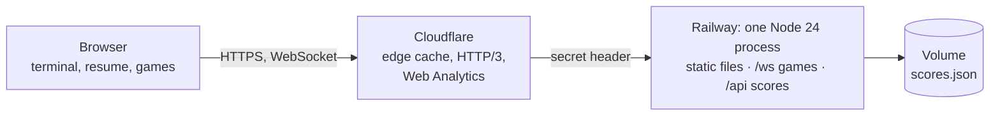

# phas.dev

**A developer portfolio you can type into.** [phas.dev](https://phas.dev) is Pedro Henrique's resume as a terminal: type
`help`, or just click the icons. It also has a plain resume that prints as a PDF, five color themes, a handful of hidden
commands, and four games, all of them playable online.

[](docs/demo.mp4)

<sub>The demo is also an [MP4 in better quality](docs/demo.mp4). Made with [Remotion](https://www.remotion.dev) from
real screenshots of the site (see [`video/`](video)).</sub>

[](https://github.com/pedrohqesilva/phas.dev/actions/workflows/ci.yml)
&nbsp;[Live site](https://phas.dev) · [English](https://phas.dev/en) · [Resume](https://phas.dev/resume) ·
[Currículo](https://phas.dev/curriculo) · [Leia em português](README.pt-BR.md)

---

## What's inside

**The terminal**

- Commands for everything on a resume: `about`, `experience` (with a detailed view per job), `projects`, `stack`,
  `education`, `contact`, `resume`.
- Tab completion, an inline suggestion as you type, command history (↑ ↓), clickable commands and an icon menu.
- Portuguese and English, with the whole screen redrawn when you switch; the address follows the language (`/` and `/en`).
- Themes: `theme dark | light | dracula | gruvbox | matrix` (Matrix rains behind the text).
- Hidden commands for people who poke around: `neofetch`, `sudo hire pedro`, `matrix`, `fortune`, `cowsay`, `vim`…
- On a phone: the prompt stays above the keyboard, the Back button closes what you opened, and swipes steer the games.

**The resume**

- [`/resume`](https://phas.dev/resume) and [`/curriculo`](https://phas.dev/curriculo): the same content without the
  terminal, in a print stylesheet that turns it into a three-page PDF.

**The games** (`games`, or the gamepad icon)

| Game           | Modes                                                                                      |
| -------------- | ------------------------------------------------------------------------------------------ |
| Snake          | Classic (walls kill or wrap) · Online arena for everyone, with power-ups and speed by size |
| Space Invaders | Classic · Co-op, two ships, room link                                                      |
| Pong           | Classic, against the computer · Versus 1v1, room link                                      |
| Tetris         | Classic · Versus, garbage lines to your rival                                              |

Solo scores go to a global leaderboard (`ranking`): today's top ten and the all-time top ten.

**Built for search engines and AI agents**: every page exists in both languages with its own HTML, plus a sitemap,
JSON-LD, Open Graph images, [`llms.txt`](https://phas.dev/llms.txt), [`llms-full.txt`](https://phas.dev/llms-full.txt)
and the resume in Markdown ([`/resume.md`](https://phas.dev/resume.md)). Search Console, Bing and IndexNow are set up.

## How it works



- **No framework.** The front end is TypeScript with the DOM and the Canvas API, built by Vite. All the copy lives in
  one file, [`src/content.ts`](src/content.ts); the terminal and the static resume both render from it.
- **One server.** [`server/index.ts`](server/index.ts) serves the built files from memory (gzip, long cache for hashed
  assets, edge cache for pages), the game WebSocket at `/ws` and the leaderboard API at `/api`. Node 24 runs the
  TypeScript directly (type stripping), so the server has no build step.
- **SEO at build time.** A Vite plugin writes one HTML file per page and language (head, JSON-LD and the full
  content baked in), plus `robots.txt`, `sitemap.xml`, `llms.txt` and the Markdown resume ([`src/seo.ts`](src/seo.ts)).

### Online games without the lag

The server is in Virginia, about 160 ms there and back from Brazil, and it decides every match. So that playing
does not feel like that, the browser shows your own moves ahead of the server:

- **Snake arena**: the server beats every 20 ms; each snake gathers move credit every beat (more when it is short) and
  steps a cell per whole credit. The browser plays your snake forward with the same rules
  ([`arena-rules.ts`](src/games/arena-rules.ts), [`arena-predict.ts`](src/games/arena-predict.ts)), to the beat a turn
  pressed now reaches the server on. Each turn is sent for that beat and applied on it, so it shows on screen at once,
  on the cell you saw. Other snakes glide along their own bodies, drawn only from steps that already happened, so they
  never jump back.
- **Invaders co-op and Pong**: your ship or paddle moves in the browser and the server follows it at a capped speed.
  Bombs and the ball are checked against where it is on your screen right now. Everything else is drawn where it is
  now, projected from the last snapshot by its speed (the ball bounces off the walls and paddles on the way). Your shots
  appear the moment you fire.
- **Tetris versus**: each player runs their own game on the same piece sequence (a shared seed); the server passes
  boards and attacks along.
- Dropped connections reconnect on their own within 15 seconds and take the same seat back.

### Security

HSTS, a strict Content Security Policy (the one inline script allowed by its hash), frame and referrer policies. The
origin only answers requests that came through Cloudflare. The game socket accepts pages from this site only, limits
connections per visitor and messages per second, and survives malformed input. Leaderboard scores need a signed run
ticket and must be possible in the time played. The container drops root right after preparing its data folder.

## Running it

Node 24 and pnpm.

```bash
pnpm install
pnpm dev          # http://localhost:5001, games and leaderboard included
```

To feel the real latency while developing, add a delay to every game message (80 ms each way is Brazil to Virginia):

```bash
GAME_LAG_MS=80 pnpm dev
```

The production build and server:

```bash
pnpm build        # type check, then dist/ with one HTML file per page and the SEO files
pnpm start        # node server/index.ts on PORT (8080 by default)
```

| Variable        | What it does                                                                            |
| --------------- | --------------------------------------------------------------------------------------- |
| `PORT`          | The server's port.                                                                      |
| `DATA_DIR`      | Where the leaderboards are saved (a volume in production).                              |
| `ORIGIN_SECRET` | When set, only requests carrying it in `x-origin-auth` are served (Cloudflare adds it). |
| `GAME_LAG_MS`   | Development only: delays every game message both ways.                                  |
| `SCORES_RESET`  | Maintenance: comma-separated boards to clear on start (then unset it).                  |

## Project layout

```
src/
  content.ts        everything the site says, in both languages
  commands.ts       the terminal's commands
  terminal.ts       prompt, streaming output, completion, history
  main.ts           boot, routes, language and theme
  static.ts         the plain resume (also the print version)
  seo.ts            head tags, JSON-LD, sitemap, robots, llms.txt
  fun.ts            the hidden commands
  games/            the games: *-sim.ts are the rules, shared with the server
server/
  index.ts          static files, headers, routes, scores API
  games.ts          the WebSocket and its rooms
  arena.ts coop.ts pong.ts tetris.ts rooms.ts
  scores.ts         leaderboards
video/              the Remotion demo (and the script that captures the screenshots)
```

## Deploy

Every push to `main` runs CI (type check, build, a smoke test of the server, and the production Docker image
built and started as Railway runs it), and Railway deploys the [`Dockerfile`](Dockerfile). After a deploy, the server
tells IndexNow that the pages changed.

## The demo video

```bash
pnpm build && PORT=8093 node server/index.ts     # the site, locally
cd video && pnpm install
node scripts/capture.ts                          # fresh screenshots into video/public/shots
pnpm render && pnpm gif                          # video/out/phas-dev.mp4 and .gif
```
