<div align="center">

<a href="https://phas.dev"></a>

<h3>
  <a href="https://phas.dev/en">Open the site</a>
  <span> · </span>
  <a href="https://phas.dev/resume">Resume</a>
  <span> · </span>
  <a href="#-how-it-works">How it works</a>
  <span> · </span>
  <a href="README.pt-BR.md">🇧🇷 Português</a>
</h3>

[](https://github.com/pedrohqesilva/phas.dev/actions/workflows/ci.yml)


<br>

<a href="docs/demo.mp4"></a>

<sub>▶ Watch the <a href="docs/demo.mp4">MP4 in better quality</a> · made with <a href="https://www.remotion.dev">Remotion</a> from real screenshots of the site (<a href="video">source</a>)</sub>

</div>

<br>

> [!TIP]
> Open [phas.dev](https://phas.dev) and type `help`. Or don't type at all: every command is clickable, and the icons at the top do the rest.
> Living in a terminal already? Try `curl phas.dev` (or `curl phas.dev/en`).

## ✨ Highlights

<table>
  <tr>
    <td width="33%" valign="top">
      <h3>⌨️ A real terminal</h3>
      Tab completion, an inline suggestion as you type, history with ↑ ↓, clickable commands. Portuguese and English, with the address following the language.
    </td>
    <td width="33%" valign="top">
      <h3>🎮 Four online games</h3>
      Snake arena for everyone, Invaders co-op and versus, Pong and Tetris versus. Lag-compensated, so 160 ms away still feels local.
    </td>
    <td width="33%" valign="top">
      <h3>🏆 Global leaderboard</h3>
      Today's top ten and the all-time top ten for every solo game, with signed run tickets so scores can't be forged.
    </td>
  </tr>
  <tr>
    <td valign="top">
      <h3>📄 Prints as a resume</h3>
      <code>/resume</code> is the same content without the terminal, and its print stylesheet turns it into a clean three-page PDF.
    </td>
    <td valign="top">
      <h3>🎨 Five themes</h3>
      <code>dark</code>, <code>light</code>, <code>dracula</code>, <code>gruvbox</code> and <code>matrix</code>, where the digital rain falls behind the text.
    </td>
    <td valign="top">
      <h3>🥚 Easter eggs</h3>
      <code>neofetch</code>, <code>sudo hire pedro</code>, <code>fortune</code>, <code>cowsay</code>, <code>vim</code> (good luck leaving)… and 17 <code>achievements</code> to unlock, a few of them secret.
    </td>
  </tr>
  <tr>
    <td valign="top">
      <h3>⚡ Tiny and fast</h3>
      No framework: about 50 KB of gzipped JavaScript, four games included. Lighthouse scores of 98 to 100.
    </td>
    <td valign="top">
      <h3>🤖 Made for bots too</h3>
      One HTML file per page and language, JSON-LD, sitemap, <a href="https://phas.dev/llms.txt"><code>llms.txt</code></a> and the resume in <a href="https://phas.dev/resume.md">Markdown</a>.
    </td>
    <td valign="top">
      <h3>📱 Feels native on a phone</h3>
      Installable and works offline. The prompt rides above the keyboard, Back closes what you opened, and swipes steer the games.
    </td>
  </tr>
</table>

## 🖥️ A look around

<table>
  <tr>
    <td align="center" width="76%">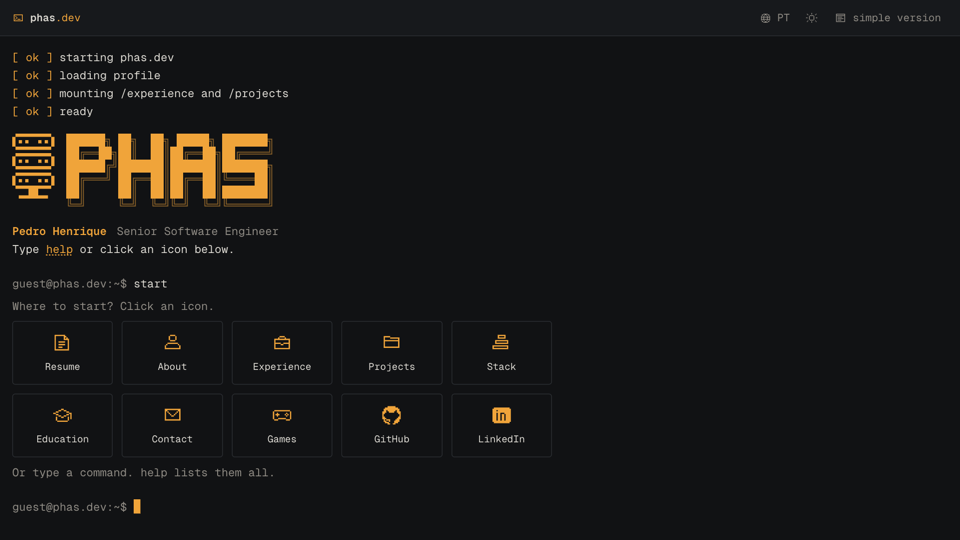<br><sub><b>The terminal</b>: type, or click</sub></td>
    <td align="center">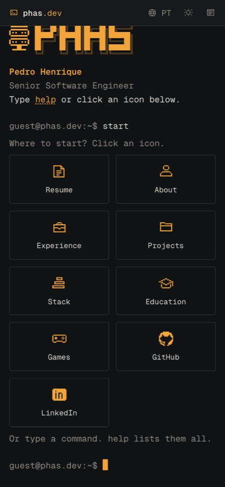<br><sub><b>On a phone</b></sub></td>
  </tr>
</table>

### 🎮 The games

`games` in the terminal, or the gamepad icon. Each game has a **Classic** mode and an online one.

<table>
  <tr>
    <td align="center" width="50%">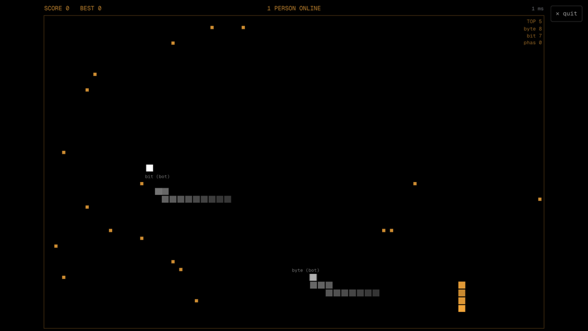<br><b>🐍 Snake</b><br><sub>Classic (walls kill or wrap) · <b>Online arena</b> with power-ups: red for speed, green for a shield</sub></td>
    <td align="center" width="50%">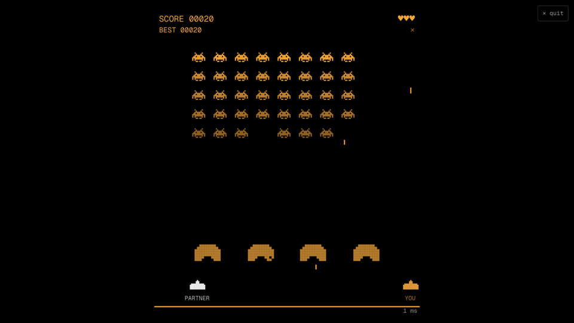<br><b>👾 Space Invaders</b><br><sub>Classic · <b>Co-op</b>, two ships against the same wave · <b>Versus</b>, a ship at each end and the aliens in between. Five hits in a row charge a special shot</sub></td>
  </tr>
  <tr>
    <td align="center">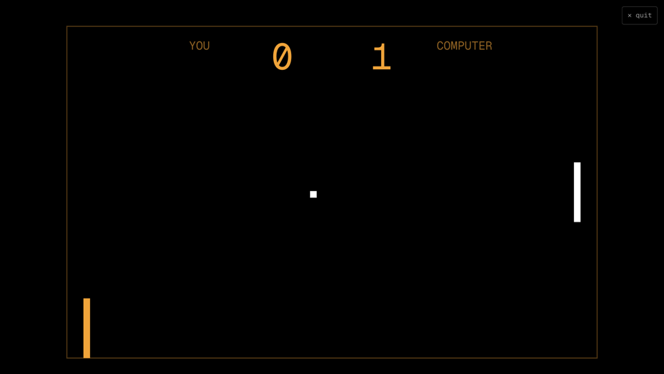<br><b>🏓 Pong</b><br><sub>Classic, against the computer · <b>Versus</b> 1v1, first to 7</sub></td>
    <td align="center">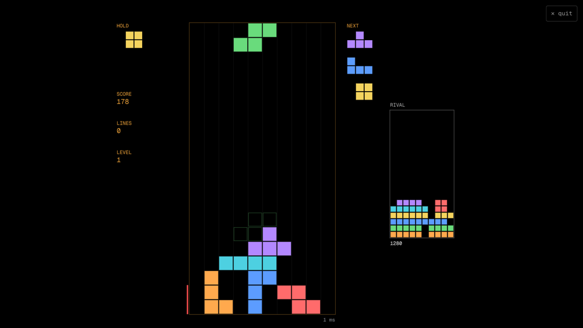<br><b>🧱 Tetris</b><br><sub>Classic · <b>Versus</b>, cleared lines become garbage for your rival</sub></td>
  </tr>
</table>

Online rooms are shared with a link, like `phas.dev/pong/ABCD`, which shows up in a chat as a card with the game and the room.

### 🎨 Themes

<table>
  <tr>
    <td align="center" width="33%">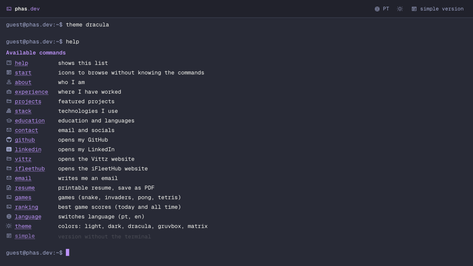<br><sub><code>theme dracula</code></sub></td>
    <td align="center" width="33%">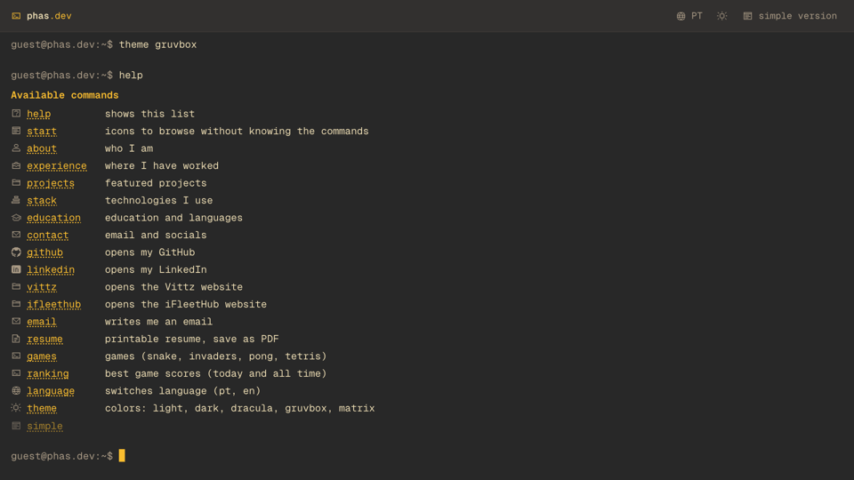<br><sub><code>theme gruvbox</code></sub></td>
    <td align="center" width="33%">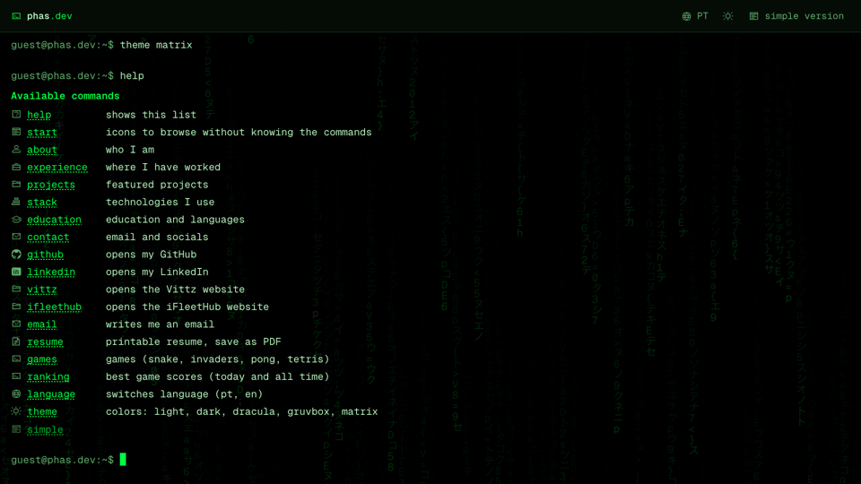<br><sub><code>theme matrix</code></sub></td>
  </tr>
</table>

## 🧭 How it works

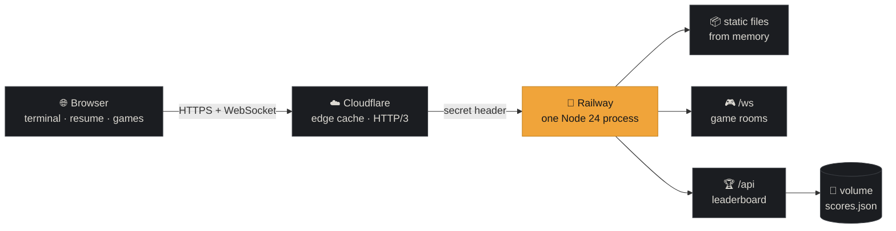

- **No framework.** TypeScript, the DOM and the Canvas API, built by Vite. Every word the site says lives in one file, [`src/content.ts`](src/content.ts), and both the terminal and the plain resume render from it.
- **One server.** [`server/index.ts`](server/index.ts) serves the build from memory (gzip, long cache for hashed assets, edge cache for pages), the game WebSocket and the leaderboard API. Node 24 runs the TypeScript directly, so there is no server build step.
- **SEO at build time.** A Vite plugin writes one HTML file per page and language with the full content baked in, plus `robots.txt`, `sitemap.xml`, `llms.txt` and the Markdown resume ([`src/seo.ts`](src/seo.ts)).
- **Shared rules.** The `*-sim.ts` files in [`src/games`](src/games) are the game rules. The browser and the server import the same code.

<details>
<summary><b>🛰️ Online games without the lag</b></summary>
<br>

The server is in Virginia, about 160 ms there and back from Brazil, and it decides every match. So that playing doesn't feel like that, the browser shows your own moves ahead of the server:

- **Snake arena.** The server beats every 20 ms; each snake gathers move credit every beat (more when it is short) and steps a cell per whole credit. The browser plays your snake forward with the same rules ([`arena-rules.ts`](src/games/arena-rules.ts), [`arena-predict.ts`](src/games/arena-predict.ts)) to the beat a turn pressed now reaches the server on. Each turn is sent for that beat and applied on it, so it shows at once, on the cell you saw. Other snakes glide along their own bodies, drawn only from steps that already happened, so they never jump back.
- **Invaders co-op, versus and Pong.** Your ship or paddle moves in the browser and the server follows it at a capped speed. It reports where it is and how fast it is going (zero the moment it stops), so bombs, shots and the ball are checked against where it is on your screen right now. Everything else is drawn where it is now, projected from the last snapshot (the ball bounces off walls and paddles on the way). Your shots appear the moment you fire.
- **Tetris versus.** Each player runs their own game on the same piece sequence (a shared seed); the server passes boards and attacks along.
- **Reconnects.** A dropped connection comes back on its own within 15 seconds and takes the same seat. The ping shows on screen.

</details>

<details>
<summary><b>🔒 Security</b></summary>
<br>

- Strict Content Security Policy (the one inline script is allowed by its hash), HSTS, frame and referrer policies.
- The origin only answers requests that came through Cloudflare.
- The game socket accepts pages from this site only, limits connections per visitor and messages per second, and survives malformed input.
- Leaderboard scores need a signed run ticket and must be possible in the time played.
- The container drops root right after preparing its data folder.

</details>

## 🚀 Running it

You need **Node 24** and **pnpm**.

```bash
pnpm install
pnpm dev          # http://localhost:5001, games and leaderboard included
```

To feel the real latency while developing, delay every game message (80 ms each way is Brazil to Virginia):

```bash
GAME_LAG_MS=80 pnpm dev
```

Production build and server:

```bash
pnpm build        # type check, then dist/ with one HTML file per page and the SEO files
pnpm start        # node server/index.ts on PORT (8080 by default)
```

<details>
<summary><b>⚙️ Environment variables</b></summary>
<br>

| Variable        | What it does                                                                            |
| --------------- | --------------------------------------------------------------------------------------- |
| `PORT`          | The server's port.                                                                      |
| `DATA_DIR`      | Where the leaderboards are saved (a volume in production).                              |
| `ORIGIN_SECRET` | When set, only requests carrying it in `x-origin-auth` are served (Cloudflare adds it). |
| `GAME_LAG_MS`   | Development only: delays every game message both ways.                                  |
| `SCORES_RESET`  | Maintenance: comma-separated boards to clear on start (then unset it).                  |

</details>

<details>
<summary><b>📁 Project layout</b></summary>
<br>

```
src/
  content.ts        everything the site says, in both languages
  commands.ts       the terminal's commands
  terminal.ts       prompt, streaming output, completion, history
  main.ts           boot, routes, language and theme
  static.ts         the plain resume (also the print version)
  seo.ts            head tags, JSON-LD, sitemap, robots, llms.txt
  pwa.ts            manifest and service worker (offline mode)
  fun.ts            the hidden commands
  achievements.ts   the achievements (kept in the browser)
  games/            the games: *-sim.ts are the rules, shared with the server
server/
  index.ts          static files, headers, routes, scores API
  games.ts          the WebSocket and its rooms
  arena.ts coop.ts invaders-versus.ts pong.ts tetris.ts rooms.ts
  scores.ts         leaderboards
video/              the Remotion demo (and the script that captures the screenshots)
```

</details>

<details>
<summary><b>🎬 Rebuilding the demo video</b></summary>
<br>

```bash
pnpm build && PORT=8093 node server/index.ts     # the site, locally
cd video && pnpm install
node scripts/capture.ts                          # fresh screenshots into video/public/shots
pnpm render && pnpm gif                          # video/out/phas-dev.mp4 and .gif
```

</details>

## 📦 Deploy

Every push to `main` runs CI: type check, build, a smoke test of the server, and the production Docker image built and started the way Railway runs it. Railway then deploys the [`Dockerfile`](Dockerfile), and the new server tells IndexNow that the pages changed.

<br>

<div align="center">

**[phas.dev](https://phas.dev)** · built by Pedro Henrique

<sub>If you came from the resume: hi! 👋 Try <code>sudo hire pedro</code>.</sub>

</div>
