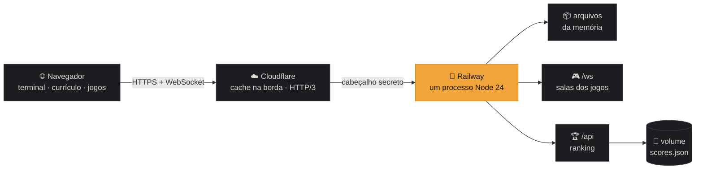

<div align="center">

<a href="https://phas.dev"></a>

<h3>
  <a href="https://phas.dev">Abrir o site</a>
  <span> · </span>
  <a href="https://phas.dev/curriculo">Currículo</a>
  <span> · </span>
  <a href="#-como-funciona">Como funciona</a>
  <span> · </span>
  <a href="README.md">🇺🇸 English</a>
</h3>

[](https://github.com/pedrohqesilva/phas.dev/actions/workflows/ci.yml)


<br>

<a href="docs/demo.mp4"></a>

<sub>▶ Veja o <a href="docs/demo.mp4">MP4 com mais qualidade</a> · feito com <a href="https://www.remotion.dev">Remotion</a> a partir de capturas reais do site (<a href="video">código</a>)</sub>

</div>

<br>

> [!TIP]
> Abra o [phas.dev](https://phas.dev) e digite `ajuda`. Ou nem digite: todo comando é clicável, e os ícones lá em cima fazem o resto.
> Já vive no terminal? Experimente `curl phas.dev`.

## ✨ Destaques

<table>
  <tr>
    <td width="33%" valign="top">
      <h3>⌨️ Um terminal de verdade</h3>
      Autocompletar com Tab, sugestão enquanto você digita, histórico com ↑ ↓, comandos clicáveis. Português e inglês, com o endereço acompanhando o idioma.
    </td>
    <td width="33%" valign="top">
      <h3>🎮 Quatro jogos online</h3>
      Arena do Snake para todos, Invaders co-op e versus, Pong e Tetris versus. Com compensação de latência: a 160 ms do servidor, parece local.
    </td>
    <td width="33%" valign="top">
      <h3>🏆 Ranking global</h3>
      Top 10 do dia e de sempre em cada jogo solo, com ticket assinado por partida para ninguém forjar pontuação.
    </td>
  </tr>
  <tr>
    <td valign="top">
      <h3>📄 Vira currículo em PDF</h3>
      <code>/curriculo</code> é o mesmo conteúdo sem o terminal, e o estilo de impressão o transforma num PDF limpo de três páginas.
    </td>
    <td valign="top">
      <h3>🎨 Cinco temas</h3>
      <code>escuro</code>, <code>claro</code>, <code>dracula</code>, <code>gruvbox</code> e <code>matrix</code>, em que a chuva digital cai atrás do texto.
    </td>
    <td valign="top">
      <h3>🥚 Easter eggs</h3>
      <code>neofetch</code>, <code>sudo contratar pedro</code>, <code>fortune</code>, <code>cowsay</code>, <code>vim</code> (boa sorte para sair)… e 17 <code>conquistas</code> para desbloquear, algumas secretas.
    </td>
  </tr>
  <tr>
    <td valign="top">
      <h3>⚡ Leve e rápido</h3>
      Sem framework: uns 50 KB de JavaScript com gzip, com os quatro jogos dentro. Lighthouse de 98 a 100.
    </td>
    <td valign="top">
      <h3>🤖 Feito para robôs também</h3>
      Um HTML por página e idioma, JSON-LD, sitemap, <a href="https://phas.dev/llms.txt"><code>llms.txt</code></a> e o currículo em <a href="https://phas.dev/curriculo.md">Markdown</a>.
    </td>
    <td valign="top">
      <h3>📱 Parece nativo no celular</h3>
      Instalável e funciona offline. O prompt fica acima do teclado, o Voltar fecha o que você abriu e os jogos se controlam deslizando.
    </td>
  </tr>
</table>

## 🖥️ Um tour

<table>
  <tr>
    <td align="center" width="76%"><br><sub><b>O terminal</b>: digite, ou clique</sub></td>
    <td align="center"><br><sub><b>No celular</b></sub></td>
  </tr>
</table>

### 🎮 Os jogos

`jogos` no terminal, ou o ícone de controle. Cada jogo tem um modo **Clássico** e um online.

<table>
  <tr>
    <td align="center" width="50%"><br><b>🐍 Snake</b><br><sub>Clássico (paredes matam ou atravessam) · <b>Arena online</b> com poderes: vermelho acelera, verde protege</sub></td>
    <td align="center" width="50%"><br><b>👾 Space Invaders</b><br><sub>Clássico · <b>Co-op</b>, duas naves contra a mesma onda · <b>Versus</b>, uma nave em cada ponta e os aliens no meio. Cinco acertos seguidos carregam um tiro especial</sub></td>
  </tr>
  <tr>
    <td align="center"><br><b>🏓 Pong</b><br><sub>Clássico, contra o computador · <b>Versus</b> 1x1, quem fizer 7 primeiro</sub></td>
    <td align="center"><br><b>🧱 Tetris</b><br><sub>Clássico · <b>Versus</b>, linhas feitas viram lixo para o rival</sub></td>
  </tr>
</table>

As salas online são compartilhadas por link, como `phas.dev/pong/ABCD`, que aparece no chat como um cartão com o jogo e a sala.

### 🎨 Temas

<table>
  <tr>
    <td align="center" width="33%"><br><sub><code>tema dracula</code></sub></td>
    <td align="center" width="33%"><br><sub><code>tema gruvbox</code></sub></td>
    <td align="center" width="33%"><br><sub><code>tema matrix</code></sub></td>
  </tr>
</table>

## 🧭 Como funciona



- **Sem framework.** TypeScript, DOM e Canvas, empacotados pelo Vite. Tudo o que o site diz fica num arquivo só, [`src/content.ts`](src/content.ts); o terminal e o currículo simples são gerados a partir dele.
- **Um servidor.** [`server/index.ts`](server/index.ts) entrega o build a partir da memória (gzip, cache longo para arquivos com hash, cache na borda para as páginas), o WebSocket dos jogos e a API do ranking. O Node 24 roda o TypeScript direto, sem etapa de build no servidor.
- **SEO no build.** Um plugin do Vite gera um HTML por página e idioma com o conteúdo inteiro, além de `robots.txt`, `sitemap.xml`, `llms.txt` e o currículo em Markdown ([`src/seo.ts`](src/seo.ts)).
- **Regras compartilhadas.** Os arquivos `*-sim.ts` em [`src/games`](src/games) são as regras dos jogos. O navegador e o servidor importam o mesmo código.

<details>
<summary><b>🛰️ Jogos online sem atraso</b></summary>
<br>

O servidor fica na Virginia, a uns 160 ms de ida e volta do Brasil, e decide todas as partidas. Para que jogar não pareça lento, o navegador mostra os seus próprios movimentos à frente do servidor:

- **Arena do Snake.** O servidor bate a cada 20 ms; cada cobra junta crédito de movimento a cada batida (mais quando é pequena) e anda uma casa por crédito inteiro. O navegador avança a sua cobra com as mesmas regras ([`arena-rules.ts`](src/games/arena-rules.ts), [`arena-predict.ts`](src/games/arena-predict.ts)) até a batida em que uma curva apertada agora chega ao servidor. Cada curva vai marcada com essa batida e é aplicada nela, então aparece na hora, na casa que você viu. As outras cobras deslizam pelo próprio corpo, só com passos que já aconteceram, e por isso nunca voltam.
- **Invaders co-op, versus e Pong.** A sua nave ou raquete anda no navegador e o servidor segue, com velocidade limitada. Ela informa onde está e a que velocidade (zero no instante em que para), então bombas, tiros e a bola são conferidos contra a posição que ela tem na sua tela agora. O resto é desenhado onde está agora, projetado a partir do último estado (a bola quica nas paredes e nas raquetes no caminho). Os seus tiros aparecem no instante da tecla.
- **Tetris versus.** Cada jogador roda o próprio jogo, com a mesma sequência de peças (uma semente compartilhada); o servidor repassa tabuleiros e ataques.
- **Reconexão.** Uma conexão que cai volta sozinha em até 15 segundos, para a mesma vaga. O ping aparece na tela.

</details>

<details>
<summary><b>🔒 Segurança</b></summary>
<br>

- Content Security Policy restrita (o único script embutido é liberado pelo hash), HSTS, políticas de frame e de referrer.
- O servidor só atende quem chega pelo Cloudflare.
- O WebSocket dos jogos só aceita páginas do próprio site, limita conexões por visitante e mensagens por segundo, e não cai com entrada malformada.
- Pontuações do ranking precisam de um ticket assinado e precisam ser possíveis no tempo jogado.
- O contêiner abre mão do root logo depois de preparar a pasta de dados.

</details>

## 🚀 Rodando

Você precisa de **Node 24** e **pnpm**.

```bash
pnpm install
pnpm dev          # http://localhost:5001, com os jogos e o ranking
```

Para sentir a latência real no desenvolvimento, atrase cada mensagem dos jogos (80 ms em cada sentido é Brasil–Virginia):

```bash
GAME_LAG_MS=80 pnpm dev
```

Build e servidor de produção:

```bash
pnpm build        # checagem de tipos e dist/, com um HTML por página e os arquivos de SEO
pnpm start        # node server/index.ts na PORT (8080 por padrão)
```

<details>
<summary><b>⚙️ Variáveis de ambiente</b></summary>
<br>

| Variável        | O que faz                                                                                           |
| --------------- | --------------------------------------------------------------------------------------------------- |
| `PORT`          | A porta do servidor.                                                                                |
| `DATA_DIR`      | Onde os rankings são salvos (um volume em produção).                                                |
| `ORIGIN_SECRET` | Quando definida, só são atendidas requisições com ela em `x-origin-auth` (o Cloudflare acrescenta). |
| `GAME_LAG_MS`   | Só em desenvolvimento: atrasa as mensagens dos jogos nos dois sentidos.                             |
| `SCORES_RESET`  | Manutenção: rankings a zerar ao iniciar, separados por vírgula (depois remova).                     |

</details>

<details>
<summary><b>📁 Estrutura</b></summary>
<br>

```
src/
  content.ts        tudo o que o site diz, nos dois idiomas
  commands.ts       os comandos do terminal
  terminal.ts       prompt, saída em fluxo, autocompletar, histórico
  main.ts           inicialização, rotas, idioma e tema
  static.ts         o currículo simples (também a versão de impressão)
  seo.ts            head, JSON-LD, sitemap, robots, llms.txt
  pwa.ts            manifest e service worker (modo offline)
  fun.ts            os comandos escondidos
  achievements.ts   as conquistas (guardadas no navegador)
  games/            os jogos: *-sim.ts são as regras, compartilhadas com o servidor
server/
  index.ts          arquivos, cabeçalhos, rotas, API do ranking
  games.ts          o WebSocket e as salas
  arena.ts coop.ts invaders-versus.ts pong.ts tetris.ts rooms.ts
  scores.ts         rankings
video/              o vídeo em Remotion (e o script que captura as telas)
```

</details>

<details>
<summary><b>🎬 Gerando o vídeo de novo</b></summary>
<br>

```bash
pnpm build && PORT=8093 node server/index.ts     # o site, localmente
cd video && pnpm install
node scripts/capture.ts                          # capturas novas em video/public/shots
pnpm render && pnpm gif                          # video/out/phas-dev.mp4 e .gif
```

</details>

## 📦 Deploy

Cada push na `main` roda o CI: checagem de tipos, build, um teste do servidor e a imagem Docker de produção montada e iniciada como o Railway roda. Aí o Railway publica o [`Dockerfile`](Dockerfile), e o servidor novo avisa o IndexNow de que as páginas mudaram.

<br>

<div align="center">

**[phas.dev](https://phas.dev)** · feito por Pedro Henrique

<sub>Se você veio do currículo: oi! 👋 Experimente <code>sudo contratar pedro</code>.</sub>

</div>
