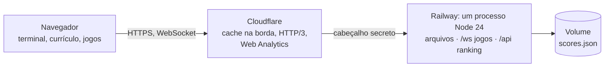

# phas.dev

**Um portfólio de dev em que você digita.** [phas.dev](https://phas.dev) é o currículo do Pedro Henrique em forma de
terminal: digite `ajuda`, ou só clique nos ícones. Tem também um currículo simples que vira PDF, cinco temas de cores,
alguns comandos escondidos e quatro jogos, todos com modo online.

[](docs/demo.mp4)

<sub>O vídeo também está em [MP4, com mais qualidade](docs/demo.mp4). Feito com [Remotion](https://www.remotion.dev) a
partir de capturas reais do site (veja [`video/`](video)).</sub>

[](https://github.com/pedrohqesilva/phas.dev/actions/workflows/ci.yml)
&nbsp;[Site](https://phas.dev) · [English](https://phas.dev/en) · [Currículo](https://phas.dev/curriculo) ·
[Resume](https://phas.dev/resume) · [Read in English](README.md)

---

## O que tem

**O terminal**

- Comandos para tudo o que um currículo tem: `sobre`, `experiencia` (com a versão detalhada de cada emprego),
  `projetos`, `stack`, `formacao`, `contato`, `curriculo`.
- Autocompletar com Tab, sugestão em cinza enquanto você digita, histórico (↑ ↓), comandos clicáveis e um menu de ícones.
- Português e inglês, com a tela inteira redesenhada na troca; o endereço acompanha o idioma (`/` e `/en`).
- Temas: `tema escuro | claro | dracula | gruvbox | matrix` (no Matrix, a chuva cai atrás do texto).
- Comandos escondidos para quem fuça: `neofetch`, `sudo contratar pedro`, `matrix`, `fortune`, `cowsay`, `vim`…
- No celular: o prompt fica acima do teclado, o Voltar fecha o que você abriu e os jogos se controlam deslizando.

**O currículo**

- [`/curriculo`](https://phas.dev/curriculo) e [`/resume`](https://phas.dev/resume): o mesmo conteúdo sem o terminal,
  com um estilo de impressão que vira um PDF de três páginas.

**Os jogos** (`jogos`, ou o ícone de controle)

| Jogo           | Modos                                                                                                       |
| -------------- | ----------------------------------------------------------------------------------------------------------- |
| Snake          | Clássico (paredes matam ou atravessam) · Arena online para todos, com super grãos e velocidade pelo tamanho |
| Space Invaders | Clássico · Co-op, duas naves, link da sala                                                                  |
| Pong           | Clássico, contra o computador · Versus 1x1, link da sala                                                    |
| Tetris         | Clássico · Versus, com linhas de lixo para o rival                                                          |

As pontuações solo vão para um ranking global (`ranking`): top 10 do dia e de sempre.

**Feito para buscadores e agentes de IA**: cada página existe nos dois idiomas com HTML próprio, mais sitemap, JSON-LD,
imagem para compartilhamento, [`llms.txt`](https://phas.dev/llms.txt), [`llms-full.txt`](https://phas.dev/llms-full.txt)
e o currículo em Markdown ([`/curriculo.md`](https://phas.dev/curriculo.md)). Search Console, Bing e IndexNow configurados.

## Como funciona



- **Sem framework.** O front-end é TypeScript com DOM e Canvas, empacotado pelo Vite. Todo o texto fica num arquivo só,
  [`src/content.ts`](src/content.ts); o terminal e o currículo simples são gerados a partir dele.
- **Um servidor.** [`server/index.ts`](server/index.ts) entrega os arquivos do build a partir da memória (gzip, cache
  longo para os arquivos com hash, cache na borda para as páginas), o WebSocket dos jogos em `/ws` e a API do ranking em
  `/api`. O Node 24 roda o TypeScript direto, sem etapa de build no servidor.
- **SEO no build.** Um plugin do Vite gera um HTML por página e idioma (head, JSON-LD e o conteúdo inteiro), além de
  `robots.txt`, `sitemap.xml`, `llms.txt` e o currículo em Markdown ([`src/seo.ts`](src/seo.ts)).

### Jogos online sem atraso

O servidor fica na Virginia, a uns 160 ms de ida e volta do Brasil, e decide todas as partidas. Para que jogar não
pareça lento, o navegador mostra os seus próprios movimentos à frente do servidor:

- **Arena do Snake**: o servidor bate a cada 20 ms; cada cobra junta crédito de movimento a cada batida (mais quando é
  pequena) e anda uma casa por crédito inteiro. O navegador avança a sua cobra com as mesmas regras
  ([`arena-rules.ts`](src/games/arena-rules.ts), [`arena-predict.ts`](src/games/arena-predict.ts)) até a batida em que
  uma curva apertada agora chega ao servidor. Cada curva vai marcada com essa batida e é aplicada nela, então aparece na
  hora, na casa que você viu. As outras cobras deslizam pelo próprio corpo, só com passos que já aconteceram, e por isso
  nunca voltam.
- **Invaders co-op e Pong**: a sua nave ou raquete anda no navegador e o servidor segue, com velocidade limitada. As
  bombas e a bola são conferidas contra a posição que ela tem na sua tela agora. O resto é desenhado onde está agora,
  projetado a partir do último estado pela velocidade de cada coisa (a bola quica nas paredes e nas raquetes no caminho).
  Os seus tiros aparecem no instante da tecla.
- **Tetris versus**: cada jogador roda o próprio jogo, com a mesma sequência de peças (uma semente compartilhada); o
  servidor repassa tabuleiros e ataques.
- Uma conexão que cai reconecta sozinha em até 15 segundos e volta para a mesma vaga.

### Segurança

HSTS, Content Security Policy restrita (o único script embutido liberado pelo hash), políticas de frame e de referrer.
O servidor só atende quem chega pelo Cloudflare. O WebSocket dos jogos só aceita páginas do próprio site, limita conexões
por visitante e mensagens por segundo, e não cai com entrada malformada. Pontuações do ranking precisam de um ticket
assinado e precisam ser possíveis no tempo jogado. O contêiner abre mão do root logo depois de preparar a pasta de dados.

## Rodando

Node 24 e pnpm.

```bash
pnpm install
pnpm dev          # http://localhost:5001, com os jogos e o ranking
```

Para sentir a latência real no desenvolvimento, atrase cada mensagem dos jogos (80 ms em cada sentido é Brasil–Virginia):

```bash
GAME_LAG_MS=80 pnpm dev
```

Build e servidor de produção:

```bash
pnpm build        # checagem de tipos e dist/, com um HTML por página e os arquivos de SEO
pnpm start        # node server/index.ts na PORT (8080 por padrão)
```

| Variável        | O que faz                                                                                           |
| --------------- | --------------------------------------------------------------------------------------------------- |
| `PORT`          | A porta do servidor.                                                                                |
| `DATA_DIR`      | Onde os rankings são salvos (um volume em produção).                                                |
| `ORIGIN_SECRET` | Quando definida, só são atendidas requisições com ela em `x-origin-auth` (o Cloudflare acrescenta). |
| `GAME_LAG_MS`   | Só em desenvolvimento: atrasa as mensagens dos jogos nos dois sentidos.                             |
| `SCORES_RESET`  | Manutenção: rankings a zerar ao iniciar, separados por vírgula (depois remova).                     |

## Estrutura

```
src/
  content.ts        tudo o que o site diz, nos dois idiomas
  commands.ts       os comandos do terminal
  terminal.ts       prompt, saída em fluxo, autocompletar, histórico
  main.ts           inicialização, rotas, idioma e tema
  static.ts         o currículo simples (também a versão de impressão)
  seo.ts            head, JSON-LD, sitemap, robots, llms.txt
  fun.ts            os comandos escondidos
  games/            os jogos: *-sim.ts são as regras, compartilhadas com o servidor
server/
  index.ts          arquivos, cabeçalhos, rotas, API do ranking
  games.ts          o WebSocket e as salas
  arena.ts coop.ts pong.ts tetris.ts rooms.ts
  scores.ts         rankings
video/              o vídeo em Remotion (e o script que captura as telas)
```

## Deploy

Cada push na `main` roda o CI (checagem de tipos, build, um teste do servidor e a imagem Docker de produção montada e
iniciada como o Railway roda), e o Railway publica o [`Dockerfile`](Dockerfile). Depois de cada deploy, o servidor avisa
o IndexNow de que as páginas mudaram.

## O vídeo

```bash
pnpm build && PORT=8093 node server/index.ts     # o site, localmente
cd video && pnpm install
node scripts/capture.ts                          # capturas novas em video/public/shots
pnpm render && pnpm gif                          # video/out/phas-dev.mp4 e .gif
```
